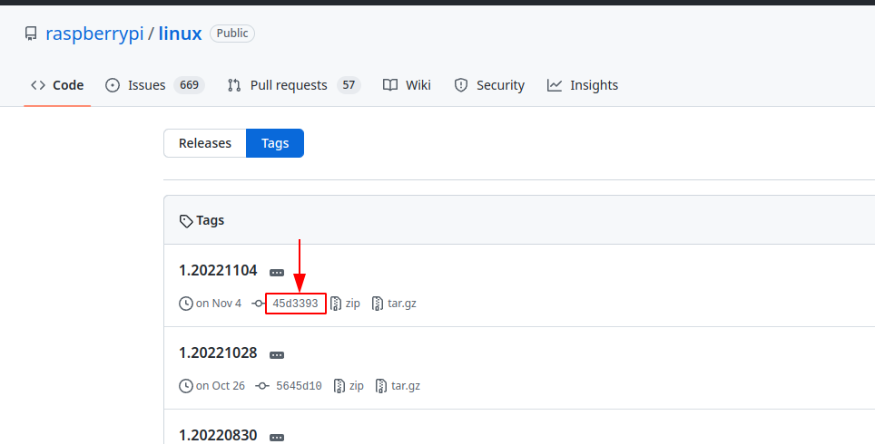

This directory stores configuration files and scripts for build test.

To run build test on your local machine, modify config in  `test.sh` and execute `./test.sh`.

# Appendix

## How to set env in `test.sh`

* **RPI_LINUX_VER**
  * select branch from here https://github.com/raspberrypi/linux/branches
  * e.g.) `rpi-5.15.y`
* **CONFIG_FILE**
  * e.g.) `config-5.15.61-v7l+`
* **RPI_LINUX_COMMIT_HASH**
  * e.g.) `6af8ae3`
* **GCC_VER**
  * e.g.) `10.2`

## How to dump kernel config file

Run the following commands in Raspberry Pi OS to dump the kernel config file.

```
sudo modprobe configs
zcat /proc/config.gz > config-$(uname -r)
```

## How to get kernel commit hash

1. Check kernel release version

```
$ dpkg -l | grep raspberrypi-kernel
ii  raspberrypi-kernel                   1:1.20221104-1                   armhf        Raspberry Pi bootloader
ii  raspberrypi-kernel-headers           1:1.20221104-1                   armhf        Header files for the Raspberry Pi Linux kernel
```

2. Find the release from raspberrypi/linux

https://github.com/raspberrypi/linux/tags

3. Copy the commit hash



## GCC Versions

### Raspbian Stretch

GCC 6.3

### Raspberry Pi OS Buster

GCC 8.3

```
$ lsb_release -a
No LSB modules are available.
Distributor ID:	Raspbian
Description:	Raspbian GNU/Linux 10 (buster)
Release:	10
Codename:	buster
$ gcc --version
gcc (Raspbian 8.3.0-6+rpi1) 8.3.0
Copyright (C) 2018 Free Software Foundation, Inc.
This is free software; see the source for copying conditions.  There is NO
warranty; not even for MERCHANTABILITY or FITNESS FOR A PARTICULAR PURPOSE.
```

### Raspberry Pi OS Bullseye

GCC 10.2

```
$ lsb_release -a
No LSB modules are available.
Distributor ID:	Raspbian
Description:	Raspbian GNU/Linux 11 (bullseye)
Release:	11
Codename:	bullseye
$ gcc --version
gcc (Raspbian 10.2.1-6+rpi1) 10.2.1 20210110
Copyright (C) 2020 Free Software Foundation, Inc.
This is free software; see the source for copying conditions.  There is NO
warranty; not even for MERCHANTABILITY or FITNESS FOR A PARTICULAR PURPOSE.
```

## REF

https://gcc.gnu.org/gcc-4.9/changes.html

https://github.com/abhiTronix/raspberry-pi-cross-compilers
